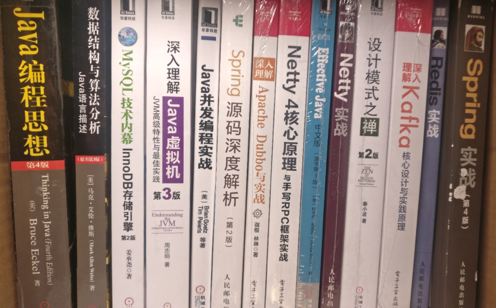

# TittleTattle
读书笔记、技术杂谈等

*立一个flag!!!*

接下来年读书清单（*ps:部分书籍已阅*）如下：
### 技术书籍
- [x] **《深入理解java虚拟机》 第三版**
- [x] **《java并发编程的艺术》**
- [ ] **《java并发编程实战》**
- [ ] **《Effective Java》第三版**
- [ ] **《设计模式之禅》**
- [ ] **《Spring实战》**
- [ ] **《Spring源码深度解析》**
- [ ] **《数据结构与算法分析》**
- [x] **《MySQL技术内幕innodb存储引擎》**
- [ ] **《Netty 4核心原理与手写RPC框架实战》**
- [ ] **《netty实战》**
- [ ] **《深入理解Apache Dubbo与实战》**
- [ ] **《Redis实战》**
- [ ] **《深入理解Kafka核心设计与实践原理》**
### 国学
- [ ] **《易经》**
- [ ] **《中国哲学简史》冯友兰著**
### 小说
- [x] **《背叛》 豆豆著**
- [x] **《天幕红尘》 豆豆著**
- [x] **《遥远的救世主》 豆豆著**

### 哲学
- [ ] **毛选第一卷**
- [ ] **毛选第二卷**
- [ ] **毛选第三卷**
- [ ] **毛选第四卷**
- [ ] **毛选第五卷**

